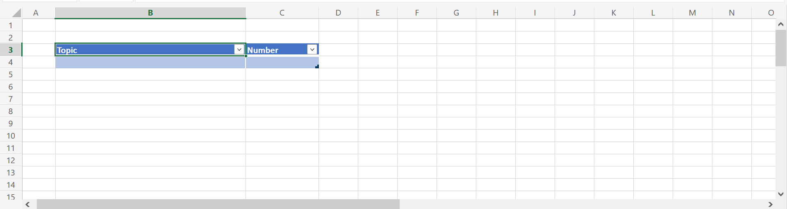
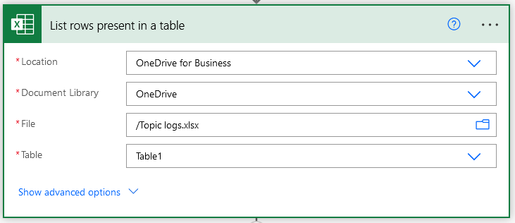
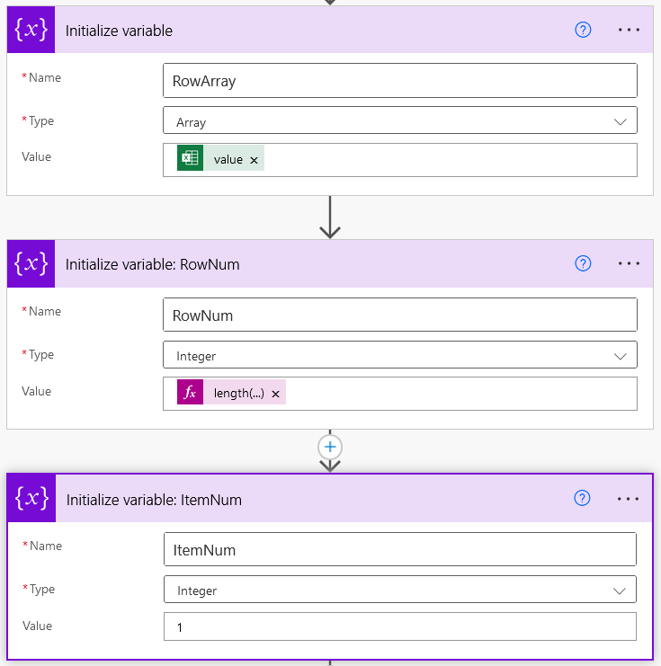
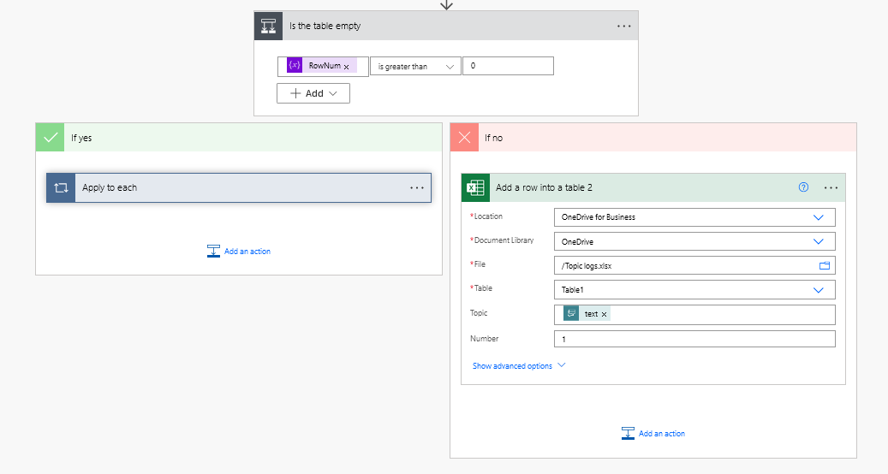
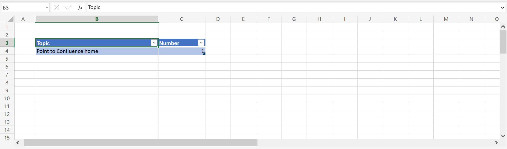
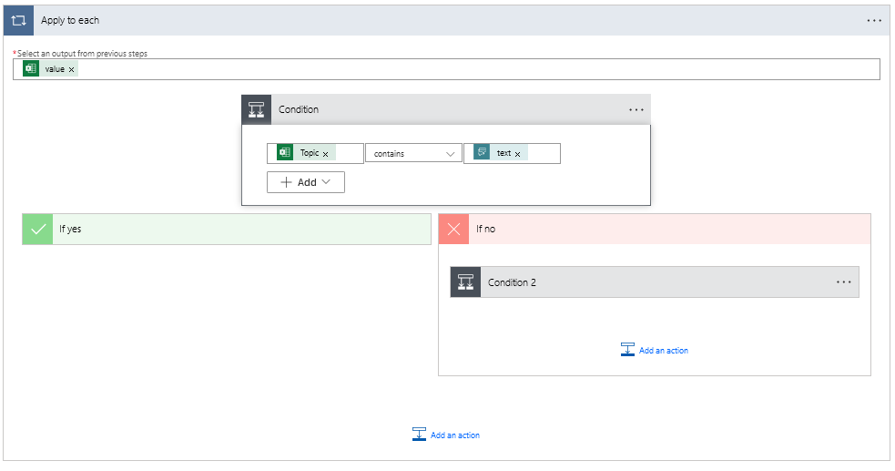
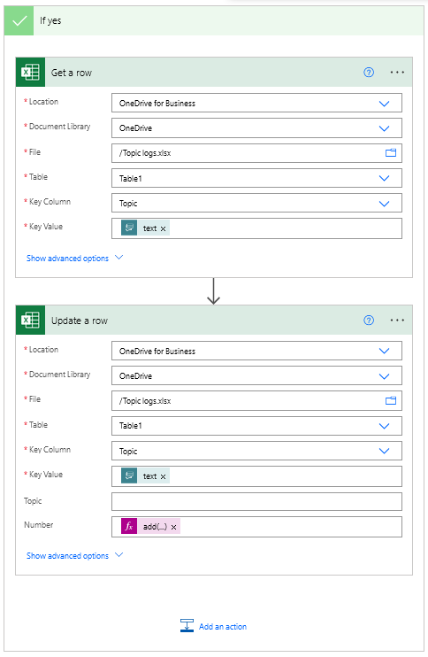
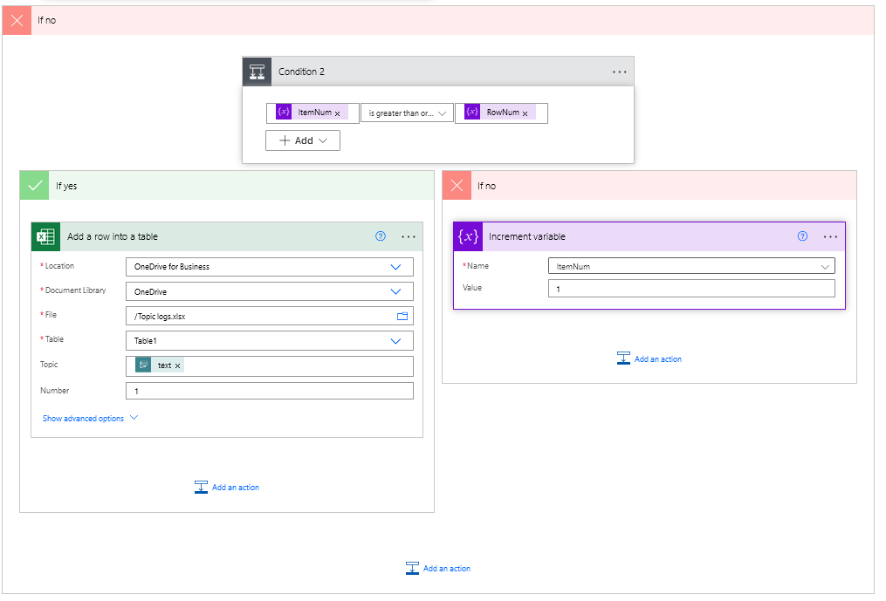
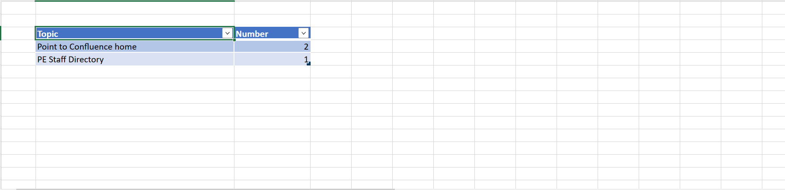

# Chatbot-Topic-Logs-Suggestions

This documentation will show how to log topics that are entered in the chatbot and it will give suggestions based on those logs 

## Logging the topics

### Create the log file in excel
A document for a the logs to be created need to be made. For this go to OneDrive and create a excel file then create a table with two columns named **Topic** and **Number**. The **Topic** column will contain the topics that are entered into the chatbot. The **Number** column with will contain the number of times a topic has been entered.

 
### Adding logs
Now you have to add logs to the file. On power apps open the chatbot and select a topic add a new node under the trigger phrase select **Call a action** then **Create a flow**

A new tab will open to power automate with a template flow. In the **When Power Virtual Agents calls a flow** trigger enter *text* into the tittle of the input

For the next step select **List Rows Present in Table** operation under the Excel **Online (Business)** connection using your login credentials. In the section **Location** choose OneDrive for Business, in **Document Libary** choose OneDrive, in File choose the name of the excel file you created  eariler. Finally in Table choose the name of the table in the excel file.

The next three steps will intialize variables the three variables will be: RowArray, RowNum and ItemNum. 

- RowArray should have the type Array and the value needs to be **Value** retrived from dynamic content in the **List Rows Present in Table**. This will contaion the table as a array
- RowNum should have the Interger and the value needs to be this expression here: `length(variables('RowArray'))`
This returns a number showing how many rows are in the table based on the length of the RowArray
- ItemNum should have the Interger and the value needs to be 1. This variable will be in a loop in a later step.

The next step should be a condition checking the log table is empty with the condition being if the variable **RowNum is greater than 0**. Below this contdion should be two sections: **If Yes or If No**.
In the no section add the step **Add a row into the table**. Include all the values you did for the **List rows present in table**. In the topic section insert the **text** value from the HTTP trigger in Dynamic Content and the number section insert 1. 

Now if you save the flow and go to the chatbot then enter a topic, a new row should be in the table of the excel file.

Go back to power automate and go to the condition made earlier and add a condition to the yes section with the condition if the Topic value from List present rows in table contains the Text value from the trigger. After it's entered a **Apply to each** operation should be overlapped on the condtion meaning it's going to check each row on the table. 

On the yes section add the step **Get a row** include all the values you did for the **List rows present in table**. In the Key Colunm section type in Topic and the Key Value section insert the **text** value from the HTTP trigger in Dynamic Content. 

Add another step **Update a row** again include all the values you did for the **Get a row**. Keep the Topic section empty and in the number section add the expression `add(int(outputs('Get_a_row')?['body/Number']), 1)`.

In the no section of the condition above add another condtion checking if the variable **ItemNum** is greater than or equal to the variable **RowNum**. In the no section choose the Increment Variable operation select ItemNum in the Name section and insert 1 in the Value section. In the Yes Section recreate the **Add a row into a table** step you did eariler. 

Save the workflow and go back to chatbot and enter a the same topic you did before and check the log file and number next to topic should have increased by 1. Test the chatbot again and enter a new topic that isn't in the logs, check the log file and a new row should have been created.

## Topic suggestions

