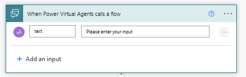

# Chatbot-Topic-Logs-Suggestions

- [Chatbot-Topic-Logs-Suggestions](#chatbot-topic-logs-suggestions)
  - [Logging the topics](#logging-the-topics)
    - [Create the log file in excel](#create-the-log-file-in-excel)
    - [Adding logs](#adding-logs)
  - [Topic suggestions](#topic-suggestions)

This documentation will show how to log topics that are entered in the chatbot and it will give suggestions based on those logs 

## Logging the topics

### Create the log file in excel
A document for the logs to be created in needs to be made. For this go to OneDrive and create an excel file then create a table with two columns named **Topic** and **Number**. The **Topic** column will contain the topics that are entered into the chatbot. The **Number** column with will contain the number of times a topic has been entered.

 

### Adding logs
Now you must add logs to the file. On power apps open the chatbot and select a topic add a new node under the trigger phrase select **Call a action** then **Create a flow**


A new tab will open to power automate with a template flow. In the **When Power Virtual Agents calls a flow** trigger enter *text* into the title of the input. Delete the action below as it's not needed.



For the next step select **List Rows Present in Table** operation under the Excel **Online (Business)** connection using your login credentials. In the section **Location** choose OneDrive for Business, in **Document Library** choose OneDrive, in File choose the name of the excel file you created earlier. Finally, in Table choose the name of the table in the excel file.


The next three steps will intialize variables the three variables will be: RowArray, RowNum and ItemNum. 

- RowArray should have the type Array and the value needs to be **Value** retrieved from dynamic content in the **List Rows Present in Table**. This will contain the table as an array.
- RowNum should have the type Interger and the value needs to be this expression here: `length(variables('RowArray'))`
This returns a number showing how many rows are in the table based on the length of the RowArray.
- ItemNum should have the type Interger and the value needs to be 1. This variable will be in a loop in a later step.


The next step should be a condition checking the log table is empty with the condition being if the variable **RowNum is greater than 0**. Below this contdion should be two sections: **If Yes or If No**.
In the no section add the step **Add a row into the table**. Include all the values you did for the **List rows present in table**. In the topic section insert the **text** value from the HTTP trigger in Dynamic Content and the number section insert 1. 


Now if you save the flow in the action inside the topic type in the name of the topic so it can be passed to Power Automate.
Go to the chatbot then enter a topic, a new row should be in the table of the excel file.


Go back to power automate and go to the condition made earlier and add a condition to the yes section with the condition if the Topic value from List present rows in table contains the Text value from the trigger. After it's entered a **Apply to each** operation should be overlapped on the condition meaning it's going to check each row on the table.


On the yes section add the step **Get a row** include all the values you did for the **List rows present in table**. In the **Key Column** section type in Topic and the **Key Value** section insert the **text** value from the HTTP trigger in Dynamic Content. 

Add another step **Update a row** again include all the values you did for the **Get a row**. Keep the Topic section empty and in the number section add the expression `add(int(outputs('Get_a_row')?['body/Number']), 1)`.


In the no section of the condition above add another condition checking if the variable **ItemNum** is greater than or equal to the variable **RowNum**. In the no section choose the Increment Variable operation select ItemNum in the Name section and insert 1 in the Value section. In the Yes Section recreate the **Add a row into a table** step you did earlier.


Save the workflow and go back to chatbot and enter a the same topic you did before and check the log file and number next to topic should have increased by 1. Test the chatbot again and enter a new topic that isn't in the logs, check the log file and a new row should have been created.


Remember to add your action to the topics that need to logged for the flows to run on them.

## Topic suggestions

For the topic suggestions when the user asks the chatbot will retrieve the 4 most frequently asked questions and display them to the user

Inside the Input suggestions topic call a new action same as the adding logs portion. You should be given the template flow. In the **When Power Virtual Agents calls a flow** trigger enter *Input* into the tittle of the input. 


The next two steps will intialize variables the two variables will be: TopLimit and ItemNum. 

- TopLimit should have the type Interger and the value needs to be 4. The value is 4 because that it the number of topics are going to be retrived
- ItemNum should have the type Interger and the value needs to be 0. This variable will be in a loop in a later step.


For the next step a script in excel needs to be made. Go to your log file and click **Automation** then click **Record actions** this will record any action you do to your excel file and generate a script from it.

On the table there should be a arrow icon, click on it and an dropdown should appear select **Sort largest to smallest** click the stop icon on the right side of page and the script should be saved, rename it to something you identify easily e.g. *Number Sort Script*.

 

Back to automate you going to run the script you just made in the next step. Create the step **Run Script** fill in the section similar to the image below having the name of your own file and script in those sections. 

A delay action needs to be added so that the script can be fully run before future steps occur. In the delay step will be 5 seconds (5 seconds is the minimum any time less than that the flow won't run correctly).

Add the **List rows present in a table** step to list the newly sorted table.


Initialize a variable called TopicArray it should be the type Array and variable should be left empty. The top 4 topics will be sorted in there as an array.

The next step will be a **Do until** condition with checking if the **ItemNum** variable is equal to he **TopLimit** variable. 

The steps inside the condition are **Append to array variable** the Name section will be TopicArray and the Value requires the expression: `outputs('List_rows_present_in_a_table')?['body/value']?[variables('ItemNum')]`

The next step is incrementing the ItemNum value by 1


After the loop is finished four variables need to be initialized. Each of them has the type string and values are expression which are taken at each index 0 to 3. Copy and paste each line to each variable.

```
variables('TopicArray')?[0]?['Topic']

variables('TopicArray')?[1]?['Topic']

variables('TopicArray')?[2]?['Topic']

variables('TopicArray')?[3]?['Topic']
```


Now return these values to the chatbot, the next step should look like the image below. Save the workflow.


Go back to power apps the topic will now require 4 new variables they need to be the same name as the 4 topic variables in the workflow. Add a message containing the variables to show they have been returned.


On the chatbot enter the input suggestion topic then select other options then the top 4 topics should be shown.

